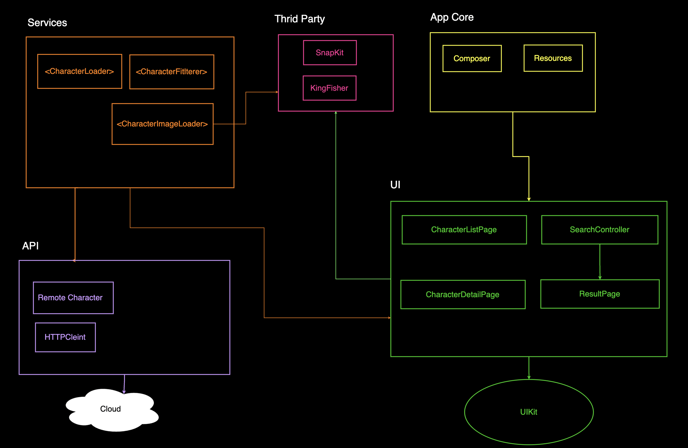

#  Rick and Morty App

  ### Purpose
My main purpose of the task to highlight the importance of *separating concerns*, *modularization*, *reusability*, *maintainability*, and *scalability*.

- The starting point is the `SceneDelegate -> setupIntitalPage` where the main screen is composed with all its dependencies: 
    - **Character List Controller** 
    -  **Search Controller**

- You can find 2 concrete types of CharacterListController : **Remote** and **Dummy** and they are self explanatory.

- Although, the app only has one API, I created multiple schemes to handle different environment variables needed for later .( Testing, Production)

 - Since the app doesn't support multiple languages, I followed a namespace class to store all strings used in the UI

### Architecture
**API**, **UI**, **Business Services** 

The diagram will explain more

### Thrid-Party Tools

 - **SnapKit** to ease the createion of layout constraints 
 - **KingFisher** to   load image view from URL

### Some of the Principles and patterns followed
Composition Root
Factory
Delegation
Observable
MVC
Dependency Injection

### Points To Enhance:

 - Beautify the app
 -    Add localizable in the correct way
 -    Write more unit tests
 -    Wrapper class for the SnapKit
